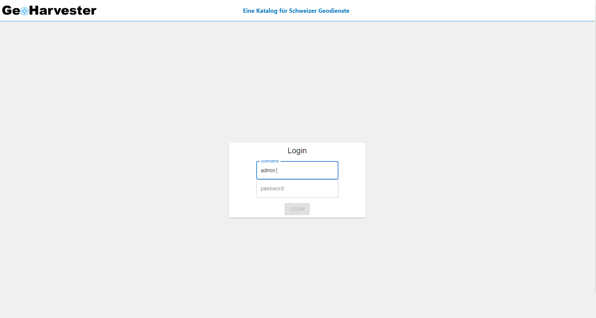
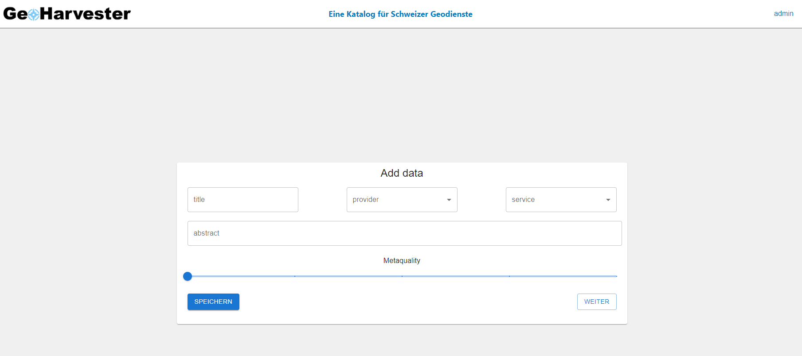
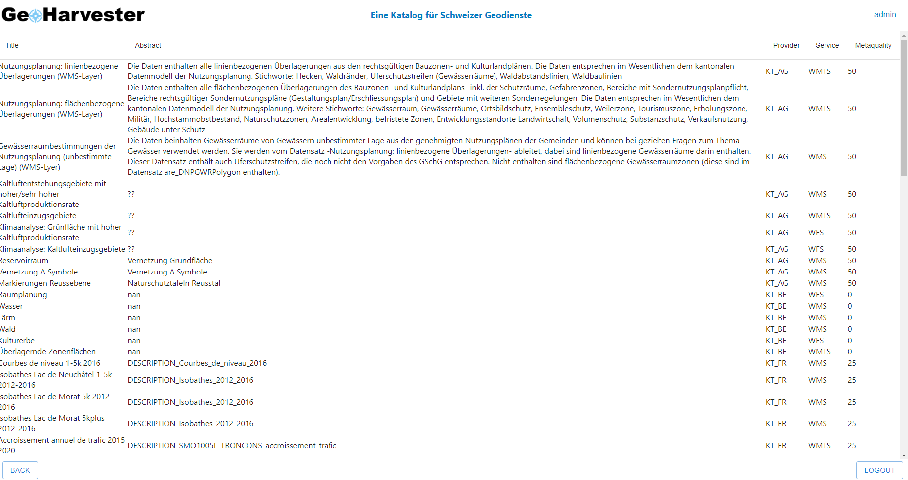
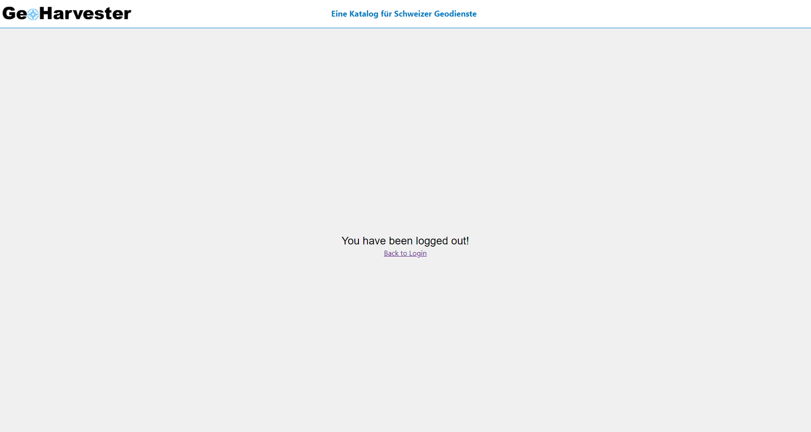

# Übung zu Lektion 05 - MUI, React Router, Komplexer State.

Wir haben in der Lektion 5 die beiden Bibliotheken "Material UI (MUI)" und "React Router" kennen gelernt. Mit diesen können wir die Geoharvester-Applikation aus der letzten Übung erweitern und mit Komponenten aus der UI-Bibliothek standardisieren. Zuletzt verwenden wir Formulare und komplexen State um Daten der Tabelle hinzuzufügen.

## Aufgabe

### React Router

Die Applikation soll mithilfe von React Router auf vier Seiten erweitert werden. Dafür benötigst du vier Routen und vier (Eltern)Komponenten, welche beim Aufruf der Route geladen werden.

- Route 1 - Login-Seite, verwende `path="/"`
- Route 2 - Formular
- Route 3 - Tabelle
- Route 4 - Logout-Seite

### MUI Komponenten

Der Ordner "html_examples" enthält als Hilfestellung Komponenten aus der letzten Übung. Wir wollen hier aber stattdessen vorgefertigte MUI-Komponenten verwenden, um die UI aufzubauen. Meistens reicht dazu bereits die einfachste Version der jeweiligen Komponente. Achte darauf, die Komponenten entsprechend zu modifizieren, da die Code-Beispiele von MUI noch nicht der Zielkomponente entsprechen. Mit zusätzlichen CSS-Deklarationen (via "id"-, "className"- oder "sx"-Prop) lässt sich die Darstellung weiter anpassen. Mit Event-Handlern und State lassen sich die Komponenten funktionalisieren.

### UI

Die UI soll im Funktionsumfang den folgenden "Screens" und Beschreibungen entsprechen. Du kannst die Darstellung nach Belieben gestalten.

#### Login-Seite

Eingabefelder für Username und Passwort. Der Username wird im Header für Route 2 und 3 angezeigt (soll simulieren: "User ist eingeloggt"). Mit Klick auf den Login-Button wird auf Route 2 weitergeleitet.

#### Formular

Header mit Username. Mit dem Formular sollen weitere Daten in die Tabelle geschrieben werden können (Klick auf "Speichern") - siehe unten. Der "Weiter"-Button leitet zur Tabelle auf Route 3.

#### Tabelle

Header mit Username. Footer mit "Back"-Button zur Route 2 (Formular) und "Logout"-Button zur Route 4. Die Tabelle soll aus State erzeugt werden (siehe unten). Die Dropdowns und Filter aus der Übung 4 wurden entfernt.

#### Logout-Seite

Header und einfache Logout-Seite mit Link zurück zum Login.

### State

Mehrere Komponenten benötigen State. Dieser muss zum Teil zwischen den Seiten (mit Hilfe von Props) geteilt werden.

#### Login

Du kannst den Code von der [Demo](https://github.com/FHNW-Geomatik/HS23-Kursrepo-WebDev-DataViz/blob/main/Lektion_04/vorlesung/demo/src/Beispiel_State/demo.js) übernehmen und anpassen oder deine eigene Variante implementieren. Der Benutzername soll im Header für Form und Tabelle angezeigt werden, daher platziere State in der App.jsx und leite den Benutzernamen als Prop weiter.
Tip: Wenn du den onSubmit-Handler der Form-Komponente aus dem Beispiel nutzen möchtest, denk daran die `preventDefault()` Funktion zu benutzen, um eine ungewollte Weiterleitung im Browser zu verhindern.

#### Formular für (einzelne) Tabelleneinträge

Hier soll ein Objekt geschrieben werden, welches einem Tabelleintrag entspricht und die Eigenschaften "title", "abstract", "provider", "service", "metaquality" (Datentyp: Number!) hat. Du benötigst ein HTML "form"-Element und einen useState-Hook in dieser Komponente. Der useState-Hook hat als initialen Wert ein Objekt mit leeren Strings und Nullen (`{title: "", metaquality: 0, usw}`).

Nutze MUI-Komponenten für die Bedienelemente der Form:

- Eingabefelder ("TextField" von MUI) für "title" und "abstract" .
- Für "provider" und "service" Dropdowns ("Select" von MUI)
- Für "metaquality" einen MUI-"Slider". Tip: Verwende dabei kein [defaultValue](https://mui.com/material-ui/api/slider/#Slider-prop-defaultValue), da die Komponente durch den initialen Wert aus dem React-State kontrolliert wird ("controlled component")

Füge jeder Komponente ein "name"-Attribut, ein "value"-Attribut und einen "onChange"-Event Handler hinzu.

Nimm wieder die Login-Form aus der [Demo](https://github.com/FHNW-Geomatik/HS23-Kursrepo-WebDev-DataViz/blob/main/Lektion_04/vorlesung/demo/src/Beispiel_State/demo.js) als Vorlage. Du kannst die gleiche "handleChange"-Funktion für alle 5 Bedienelemente der Form verwenden, um mit einer einzigen setState-Funktion State zu modifizieren.

Achte darauf, dass das "name"-Attribut des jeweiligen Bedienelements mit der Eigenschaft des State-Objektes übereinstimmt, die dadurch geändert werden soll
(siehe `setData(() => ({ ...data, [name]: value }));` in der Demo).

#### State für Tabellendaten

Die Tabelle (Route 3) soll ebenfalls aus State generiert werden. Platziere den useState-Hook in der App.jsx, da sowohl Form als auch Tabelle darauf zugreifen müssen. Nimm als initialen Wert die Daten aus `/data/tableData.js`.

Füge dem Formular (Route 2, siehe oben) einen MUI-Button mit dem Attribut `type="Submit"` hinzu. Dieser muss innerhalb der `<form>...</form>`-Tags platziert werden.
Der onSubmit-Handler der Form (Button "Speichern" s.o.) soll den (lokalen) State des Formulars als Tabelleneintrag (Objekt) den bereits vorhandenen Tabelleneinträgen (ein Array mit Objekten) hinzufügen. Orientiere dich an der "Todo" Liste aus dem [Beispiel](https://github.com/FHNW-Geomatik/HS23-Kursrepo-WebDev-DataViz/blob/main/Lektion_04/vorlesung/demo/src/Beispiel_State/demo.js).

Der onSubmit-Handler muss dabei mehrere Funktionen aufrufen:

- Die `preventDefault()`- Funktion um das HTML-Form-Handling (Weiterleitung) zu unterbinden.
- Die setState Funktion (aus der App.jsx) um das Objekt (aus der Form) dem Array mit Tabellendaten hinzuzufügen, ohne diesen zu mutieren.
- Die (lokale) setState Funktion in der Form, um den dortigen State wieder auf das ursprüngliche Objekt (initialen State) zurück zu setzen. Damit sollen die Eingabefelder und der Slider ebenfalls zurück gesetzt werden, damit eine neue Eingabe möglich ist (die Dropdowns können so bleiben wie sie sind).

### Testing

Teste deine App auf mögliche Fehler. Hast du einen kompletten "User-Flow", ist jede Komponente erreichbar? Sind mit dem Formular erstellte Daten in der Tabelle sichtbar? Gibt es irgendwo Bugs?

## Regeln

Bitte halte dich an folgende Regeln:

- Fragen zunächst selbst versuchen zu lösen (Script, Google).
- Bei technischen Problemen unbedingt nachfragen!
- **Kein Copy Paste** von ausserhalb deines Git-Accounts oder dem Internet (ausser für MUI-Komponenten).

## Links:

- [React](https://react.dev/)
- [MUI](https://mui.com/material-ui/getting-started/) - siehe "Components" in der Seitenleiste.
- [React Router](https://reactrouter.com/en/main) - da die Dokumentation sehr umfangreich und komplex ist, besser auf das Script ausweichen.
